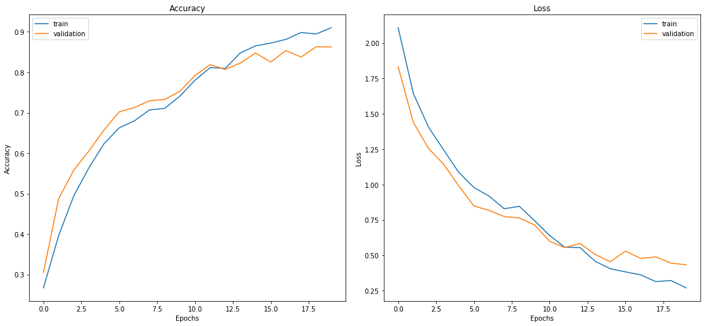
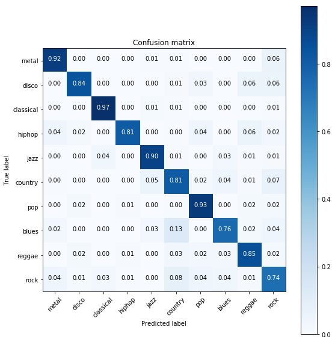

## gtzan.keras

>  Music Genre classification using Convolutional Neural Networks. Implemented in Keras

### Dataset

And how to get the dataset?

1. Download the GTZAN dataset [here](http://opihi.cs.uvic.ca/sound/genres.tar.gz)

Extract the file in the **data** folder of this project. The structure should look like this:

```bash
├── data/
   ├── genres
      ├── blues
      ├── classical
      ├── country
      .
      .
      .
      ├── rock
```

### How to run

To run the training process in the gtzan files:

```bash
$ cd src/
$ python gtzan.py -t train -d ../data/genres/
```

After the execution the model will be save on the *models* folder. To run in a custom file, you should run as follow:

```bash
$ cd src/
$ python gtzan.py -t test -m ../models/YOUR_MODEL_HERE -s ../data/SONG_TO_TEST_HERE
```

### Overview

*tl;dr*: Compare the classic approach of extract features and use a classifier (e.g SVM) with the modern approach of using CNNs on a representation of the audio (Melspectrogram). You can see both approaches on the **nbs** folder in the Jupyter notebooks. 

For the deep learning approach:

1. Read the audios as melspectrograms, spliting then into 3s windows with 50% overlaping resulting in a dataset with the size 19000x129x128x1 (samples x time x frequency x channels)**.
2. Shuffle the input and split into train and test (70%/30%)
3. Train the CNN and validate using the validation dataset

** In the case of the VGG, the channel need to have 3 channels

### Parameters

In the src folder there is an file *gtzan.py* which you can use to tune your program parameters. The graphics presented here were constructed with the default setting of this program.

### Model

You can tune the model (Add more layers, change kernel size or create a new one) by editing the file *src/gtzan/model.py*.

### Results

To compare the result across multiple architectures, we have took two approaches for this problem: One using the classic approach of extracting features and then using a classifier. The second approach, wich is implemented on the src file here is a Deep Learning approach feeding a CNN with a melspectrogram.

You can check in the nbs folder on how we extracted the features, but here are the current results for a k-fold (k = 5):

| Model | Acc | Std |
|-------|-----|-----|
| Decision Tree | 0.502 | 0.03 |
| Logistic Regression | 0.700 | 0.013 |
| Random Forest | 0.708 | 0.032 |
| SVM (RBF) | 0.762 | 0.034 |

For the deep learning approach we have tested two models: CNN 2D and a VGG16-like model. Reading the file as melspectrograms and split the 30s into 3s files with 50% overlaping, using a training split of 70% for train and 30% test. The process was executed 3x to ensure it wasn't a luck split.

| Model | Acc | Std |
|-------|-----|-----|
| CNN 2D | 0.832    | 0.008 |
| VGG16  | 0.864    | 0.012 |




