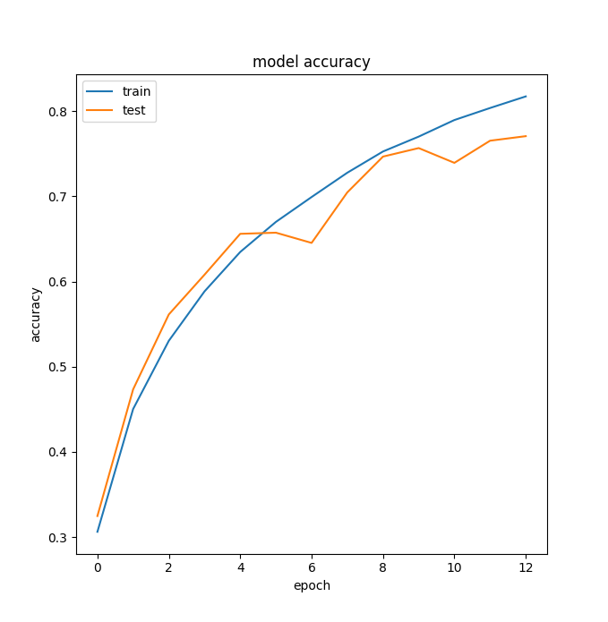
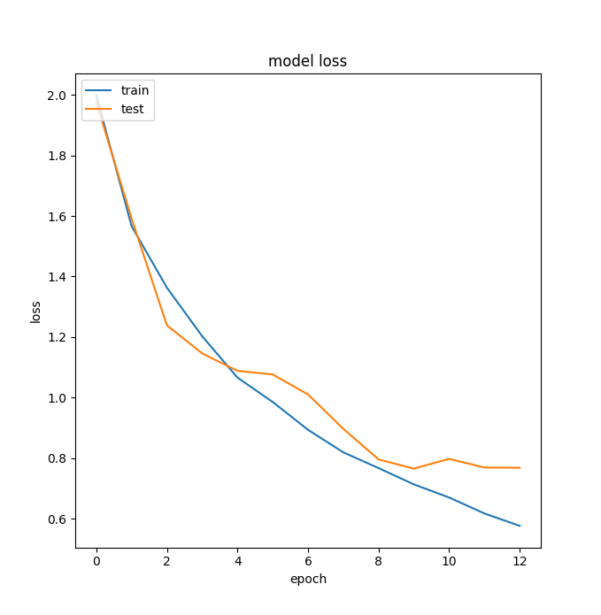

## gtzan.keras

>  Music Genre classification using Convolutional Neural Networks. Implemented in Keras

### Dependencies

* Numpy
* Scipy
* Librosa
* Keras
* Tensorflow
* Scikit-learn
* h5py

### Dataset

And how to get the dataset?

1. Download the GTZAN dataset [here](http://opihi.cs.uvic.ca/sound/genres.tar.gz)

Extract the file in the dataset folder of this project. The structure should look like this:

```bash
├── dataset/
   ├── GTZAN
      ├── blues
      ├── classical
      ├── country
      .
      .
      .
      ├── rock
```

### How to run

To run the Genre classifier:

```bash
$ cd src/
$ python train.py
```

### Overview

1. Read the audios as melspectrograms with size 1000x1280x128(samples x time x frequency)
2. Shuffle the input and split into train, validation and test (Usually 75%,15%,10%)
3. Split each sample in 10 parts. Now the input has the size 128x128
4. Train the CNN and validate using the validation dataset
5. Test the CNN accuracy in the test set.
6. As we try to discover the genre of each slice on the test set, now we want to classify each entire song. For this we use a majority voting system (Basically is the mode of the 10 slices).
7. Plot and print the results

### Parameters

In the source folder there is an file *params.ini* which you can use to tune your program parameters.

You can have two types for reading the audio files: as .npy (NPY) files or straigth from the .au (AUDIO_FILES). Using the .npy is faster to read, but in the first time running you should select the AUDIO_FILES option and set the variable SAVE_NPY to True to save the npy file and use next time.

The other parameters and the options associated are:

* **TYPE**: [NPY or AUDIO_FILES]. Format reading
* **GTZAN_FOLDER**: Path to GTZAN Folder
* **SAVE_MODEL**: Path to save the trained model
* **SAVE_NPY**: [True or False]n Save or not a NPY file with the audios already converted
* **CNN_TYPE**: 1D (@TODO. In next version we also want to implement a 2D version)
* **EXEC_TIMES**: [INTEGER]. Number of times to train the CNN shuffling the data. Important to see if the NN is not getting a good result only for a lucky split. 
* **BATCH_SIZE**: [INTEGER]. Number of samples to use in each batch.
* **EPOCHS**: [INTEGER]. Max number of epochs to train the NN. Note that we have an EarlyStop callback

The are others variables that you can tune in the *src/train.py* file, such as the optmizer config.

### Model

You can tune the model (Add more layers, change kernel size, etc) by editing the file *src/audiomanip/audiomodels.py*.

### Results

Here are some results of one architectures used in this work. The details:

* Split: 75% Train, 15% Val e 10% Test
* EXEC_TIMES: 5
* BATCH_SIZE: 32
* EPOCHS: 100 (Max), but usually converges at ~15

Results:

* Validation accuracy - mean: 0.8191, std: 0.03411 (Validation history)
* Test accuracy - mean: 0.7034, std: 0.02263 (Test history)
* Test accuracy MVS - mean: 0.7760, std: 0.04128 (Test history using Majority Voting System)



